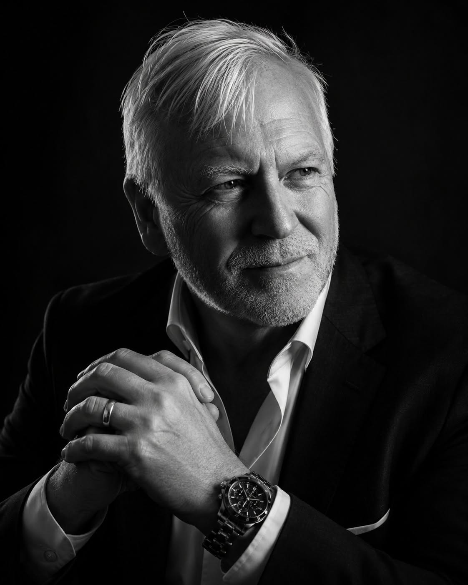

<!--
  ┌────────────────────────────────────────────────────────────────┐
  │  GitHub Profile README · 24pfilms (Taylor Moore)               │
  │  Lives at the PUBLIC repo named exactly "24pfilms".            │
  │  Cinematic monochrome theme. Placeholders marked TODO.          │
  └────────────────────────────────────────────────────────────────┘
-->

<!-- ============================= HERO ============================= -->

  

<h1 align="center">Taylor&nbsp;Moore</h1>

  

<!-- ============================= SOCIAL ============================= -->

  
  
  <!-- TODO: replace # with your Skool URL once the community is live -->
  

  
  

<!-- ===================== CONTRIBUTION HEATMAP (featured high) ===================== -->
<h3 align="center">📈 &nbsp;Contribution activity</h3>

  

<!-- ============================= ABOUT ============================= -->
##  &nbsp; About me

I'm **Taylor Moore** — a photographer and filmmaker who got tired of the gap between what AI *can* do and what actually helps you **make the shot**. So I build the tools.

Under **[SquareCircle Labs](https://squarecirclelabs.com)** I design AI-assisted software for filmmakers and photographers — generation, editing, and on-set workflow tools built by someone who's actually behind the camera, not just behind a keyboard.

- 🎬 &nbsp;Building **OrcaFilm** & **OrcaEdit** — AI tooling for film & post
- 📸 &nbsp;Shooting stills and motion when I'm not shipping code
- 🧪 &nbsp;Sharing the build in the open — YouTube & a community launching soon
- 💬 &nbsp;Ask me about AI video pipelines, look-dev, and editorial automation

<!-- TODO: add a personal line or two — your story / what you're known for. -->

<!-- ============================= PROJECTS ============================= -->
## 🎥 &nbsp; Flagship projects

<table>
  <tr>
    <td width="50%" valign="top">
      <h3 align="center">🐋 OrcaFilm</h3>
      

        <!-- TODO: one-sentence description of OrcaFilm -->
        <em>AI film / look-dev tooling — one line coming soon.</em>
      

      

    </td>
    <td width="50%" valign="top">
      <h3 align="center">✂️ OrcaEdit</h3>
      

        <!-- TODO: one-sentence description of OrcaEdit -->
        <em>AI-assisted editing — one line coming soon.</em>
      

      

    </td>
  </tr>
</table>

More tools on the way — this section grows as they ship.

<!-- ============================= TECH ============================= -->
## 🧰 &nbsp; Tech I build with

<b>AI &amp; media</b>

  
  
  
  
  
  

<b>App &amp; web</b>

  
  
  
  
  

<b>Craft</b>

  
  
  

<!-- TODO: add/remove badges so this matches the tools you actually use. -->

<!-- ============================= STATS ============================= -->
## 📊 &nbsp; By the numbers

  

<!-- Contribution snake (generated by .github/workflows/snake.yml) -->

  <picture>
    <source media="(prefers-color-scheme: dark)" srcset="https://raw.githubusercontent.com/24pfilms/24pfilms/output/github-contribution-grid-snake-dark.svg" />
    <source media="(prefers-color-scheme: light)" srcset="https://raw.githubusercontent.com/24pfilms/24pfilms/output/github-contribution-grid-snake.svg" />
    
  </picture>

<!-- ============================= CONNECT ============================= -->
## 📫 &nbsp; Let's connect

  🌐 <a href="https://squarecirclelabs.com">squarecirclelabs.com</a>
  &nbsp;·&nbsp; ▶️ <a href="https://www.youtube.com/@taylormoorePT">YouTube @taylormoorePT</a>
  &nbsp;·&nbsp; 🎓 Skool — <b>coming soon</b>
  <!-- TODO: add public email or other links here -->

<i>Square peg, round hole — I build the adapter.</i>

